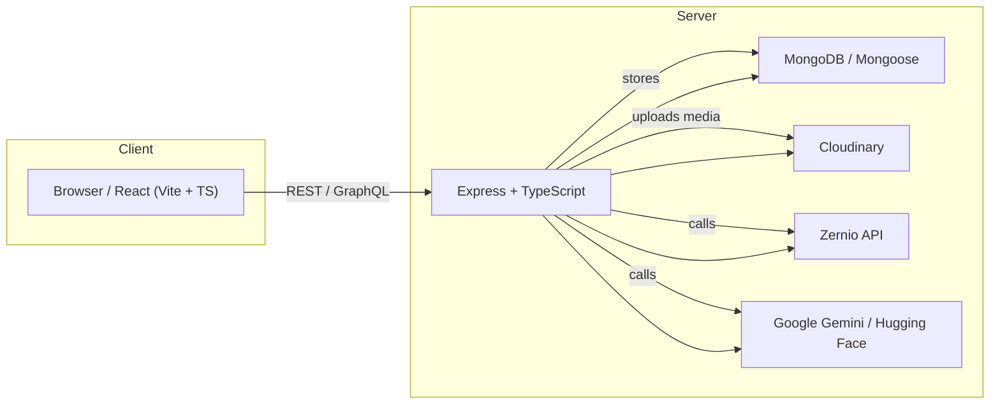
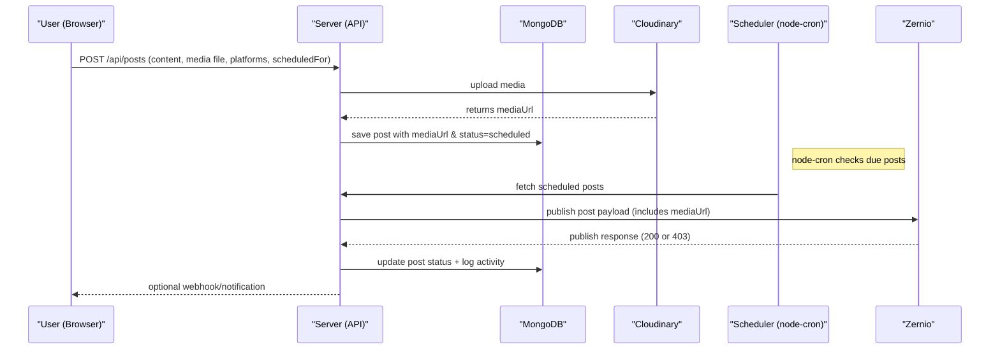
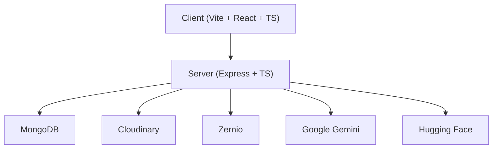

# SocialAI Scheduler (MERN + AI)

A social media scheduling platform built with the MERN stack, integrated with AI generation (Google Gemini / Hugging Face), Cloudinary media uploads, and Zernio for multi-platform publishing.

**Key features**
- Compose AI-generated posts and images
- Schedule posts to multiple platforms
- Media upload handling with Cloudinary
- Scheduler that publishes via Zernio
- React + Vite TypeScript frontend and Express TypeScript backend

**Quick Links**
- Client: client/
- Server: server/
- Scheduler service: server/services/schedulerService.ts
- Zernio config: server/config/Zernio.ts

**Architecture (overview)**



**Sequence: scheduling a post with image**



**Component diagram (high level)**



**Project setup (local)**

Prerequisites:
- Node.js (16+ recommended)
- npm or yarn
- MongoDB (local or Atlas)

Environment variables

Create `.env` files for `server` (and optionally `client/.env`) with these keys:

- `MONGO_URI` — MongoDB connection string
- `JWT_SECRET` — JSON Web Token secret
- `CLOUDINARY_CLOUD_NAME` — Cloudinary account name
- `CLOUDINARY_API_KEY` — Cloudinary API key
- `CLOUDINARY_API_SECRET` — Cloudinary API secret
- `ZERNIO_API_KEY` — Zernio API key (for publishing)
- `HF_TOKEN` — Hugging Face token (if used)
- `GOOGLE_API_KEY` or credentials — for Google Gemini / GenAI (if used)

Example: [server/.env](server/.env)

Install and run (server and client separate):

```bash
# from project root
cd server
npm install
npm run dev   # or `npm start` depending on scripts

# in separate terminal
cd client
npm install
npm run dev
```

Build for production:

```bash
# client
cd client
npm run build

# server (transpile or run via ts-node/ts-node-dev)
cd server
npm run build
npm start
```

**Debugging scheduler / publish failures**
- Check the server logs where `schedulerService` logs payload and Zernio response.
- Confirm `mediaUrl` saved in MongoDB is accessible (public URL) and Cloudinary returned a full HTTPS URL.
- If Zernio returns 403 only when images attached, confirm account/platform permissions and that the payload `mediaItems` field matches Zernio's expected shape (accountId, type, url).
- Inspect `server/config/Zernio.ts` and ensure the API key is valid for the action (publish scope).

**Where to look in this repo**
- API controllers: `server/controllers/*`
- Scheduler logic: `server/services/schedulerService.ts`
- Cloudinary utils: `server/config/cloudinary.ts`
- Zernio client: `server/config/Zernio.ts`
- Frontend uploader: `client/src/pages/Scheduler.tsx` (FormData usage)

**Contributing**
- Fork the repo and create feature branches.
- Keep backend changes minimal and add tests where possible.
- Add TypeScript types for external API responses where helpful.

**Suggested next work items**
- Add CI to run `npm run build` for client and server on PRs.
- Add E2E tests for scheduling flow (mock Zernio).
- Harden error handling and retry logic for publish failures.

**License**
MIT

---

If you want, I can:  
- add example `.env.example`,  
- generate a simple GitHub Actions CI file, or  
- update `server/services/schedulerService.ts` to log full Zernio responses for easier debugging.  
Which should I do next? 
